# Что такое N-уровневая архитектура

Приложения с этой архитектурой делятся на несколько уровней, каждый со своими обязанностями и функциями, такими как
пользовательский интерфейс, службы, данные, тестирование и т. д. Например, при создании приложения создается отдельный
проект или решение для пользовательского интерфейса, затем еще один для служб, еще один для уровня дан-ных и т. д. В
итоге объединение нескольких проектов дает целое приложение.

➕

- n-уровневые приложения позволяют четко разделить задачи и рассматривать такие элементы, как пользовательский
  интерфейс, данные и бизнес-логику по отдельности;
- команды разработчиков могут работать над различными компонентами независимо друг от друга;
- корпоративная архитектура хорошо изучена, поэтому относи-тельно легко найти квалифицированных разработчиков для
  многоуровневых проектов.

➖

- после внесения изменений в код приходится останавливать и повторно запускать все приложение;
- сообщения, как правило, курсируют вверх и вниз через уровни, что может быть неэффективным;
- рефакторинг большого многоуровневого приложения после развертывания может оказаться сложной задачей.

# Что такое монолитная архитектура

Монолитное приложение доставляется как единственный развертываемый программный артефакт. Все его компоненты –
пользовательский интерфейс, бизнес-логика и логика доступа к базе данных – объеди-нены в единое приложение и
развертываются на сервере приложе-ний.

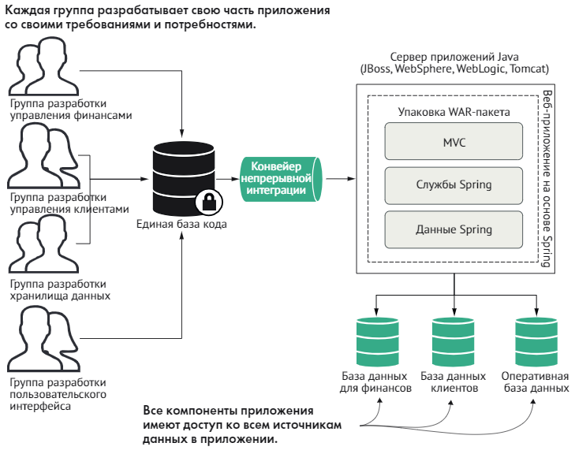

# Что такое микросервис?

Микросервис – это небольшая, слабо связанная распределенная служба.

➕

- микросервисы позволяют взять приложение с обширным набором функций и разложить его на простые в управлении компоненты
  с четко определенными обязанностями.
- микросервисы помогают преодолевать традиционные проблемы сложности большой базы кода, разбивая ее на небольшие четко
  определенные части.
- «Разбив» приложения на мелкие службы и переместив их из единого монолитного артефакта в распределенную среду, можно
  строить системы:
    + **гибкие** Чем меньше единица служба, тем проще ее изменить и тем меньше времени уходит на ее тестирование и
      развертывание;
    + **устойчивые** В случае неисправимой ошибки приложение может продолжать работать, оказывая более узкий круг услуг;
    + **масштабируемые** Масштабирование небольших служб проще и намного рентабельнее

Ключевые понятия, о которых следует помнить, рассуждая о микросервисах, – это _декомпозиция_ и _развязка_ (unbunding).

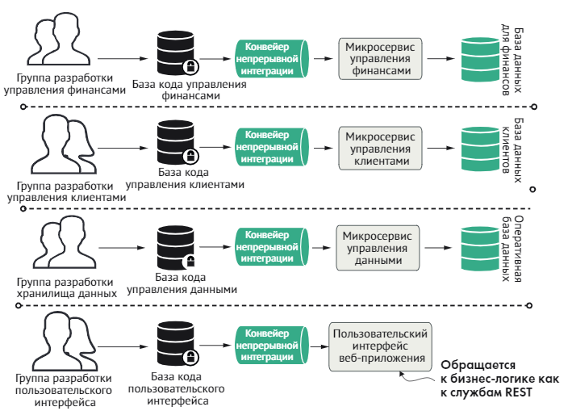

При использовании микросервисной архитектуры приложение CRM разбивается на набор независимых микросервисов, что
позволяет каждой группе разработчиков двигаться вперед в своем собственном темпе.

### характеристики микросервисной архитектуры ### 

- логика приложения разбита на мелкие компоненты с четко определенными согласованными границами ответственности;
- каждый компонент отвечает за узкий круг задач и развертывается независимо от других; один микросервис отвечает за одну
  часть предметной области;
- для обмена данными между собой микросервисы используют облегченные протоколы, такие как HTTP и JSON.
- приложения на основе микросервисов всегда обмениваются данными с использованием технологически нейтрального формата
  (чаще всего используется JSON), поэтому техническая реализация службы не имеет значения; это означает, что приложение,
  состоящее из микросервисов, может быть написано на нескольких языках и с использованием нескольких технологий;
- микросервисы – благодаря небольшому размеру, независимо-му и распределенному характеру – позволяют организациям иметь
  небольшие группы разработчиков с четко определенными сферами ответственности.

_**небольшие, простые и разделенные службы = масштабируемые, устойчивые и гибкие приложения.**_

# Ключевые особенности микросервисов на основе Spring Boot, Spring Cloud # 

- встроенный веб-сервер, помогающий избежать сложностей при развертывании приложения: Tomcat (по умолчанию), Jetty или
  Undertow;
- предопределенная конфигурация для быстрого начала работы над проектом;
- автоматическая настройка возможностей Spring – когда это возможно;
- широкий спектр возможностей, готовых к использованию в промышленном окружении (таких-как метрики, безопасность,
  проверка статуса, хранение конфигурации вовне и т. д.).

➕

- сокращает время разработки и увеличивает эффективность и производительность
- предлагает встроенный HTTP-сервер для запуска веб приложений;
- позволяет избавиться от большого количества шаблонного кода;
- упрощает интеграцию с экосистемой Spring (включая Spring Data, Spring Security, Spring Cloud и др.);
- предоставляет коллекцию различных плагинов для разработки.

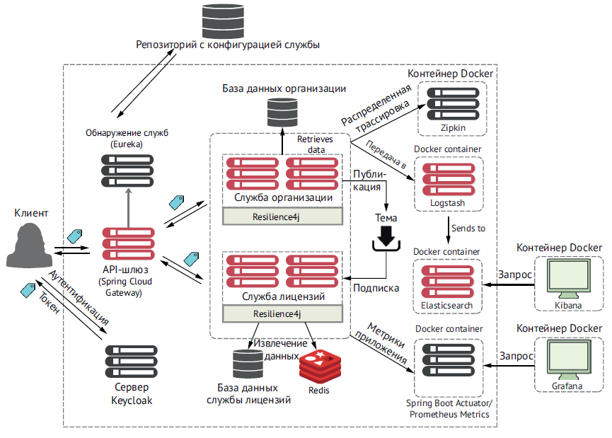

Общая структура сервисов и технологий этого проекта

Создание микросервиса с помощью Spring Boot

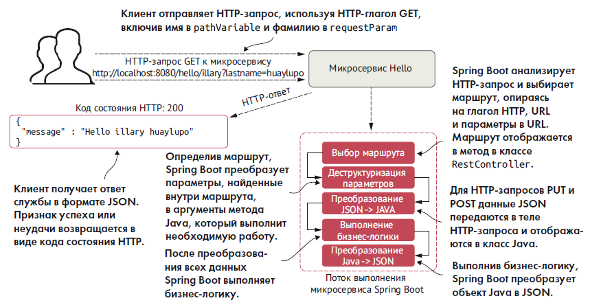

На рисунке показано, что будет делать эта служба и общий поток обработки запроса пользователя в микросервисе Spring
Boot.

Пример микросервиса на Spring

#### Main класс (точка входа) ####

```kotlin
package com.o.surovtsev

import org.springframework.boot.autoconfigure.SpringBootApplication
import org.springframework.boot.runApplication

@SpringBootApplication
class DemoApplication

fun main(args: Array<String>) {
    runApplication<DemoApplication>(*args)
}
```

#### Доменная модель ####

```kotlin
package com.o.surovtsev.domain

data class HelloRequest(
    val firstName: String,
    val lastName: String
) {
    override fun toString(): String {
        return "$firstName $lastName"
    }
}
```

#### Контроллер ####

```kotlin
package com.o.surovtsev.controller

import com.o.surovtsev.domain.HelloRequest
import org.springframework.web.bind.annotation.*

@RestController
@RequestMapping(value = ["hello"])
class HelloController {

    @GetMapping(value = ["/{firstName}"])
    fun helloString(
        @PathVariable("firstName") firstName: String,
        @RequestParam("lastName") lastName: String
    ): String {
        return String.format(
            "{\"message\":\"Hello %s\"}", HelloRequest(firstName, lastName)
        )
    }
}
```

После старта в консоли мы можем видеть порт веб сервера (по умолчанию 8080)
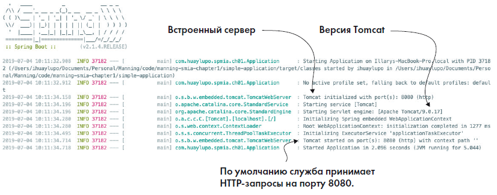

Мы можем сделать HTTP-запрос GET к конечной точке /hello

```http request
localhost:8080/hello/illary?lastName=huaylupo
```

и полученный ответ в формате JSON

```json
{
  "message": "Hello illary huaylupo"
}
```

# Что такое облачные вычисления? #

Облачные вычисления – это оказание вычислительных и актуализированных ИТ-услуг – баз данных, сетей, программных
продуктов, серверов, аналитики и много другого – через интернет для предоставления гибкого, безопасного и простого в
использовании окружения.

Модели облачных вычислений позволяют пользователю выбирать уровень контроля над информацией и услугами, которые они
предоставляют.

- _Инфраструктура как услуга (Infrastructure as a Service, IaaS)_. Поставщик предоставляет инфраструктуру, которая
  позволяет получать доступ к вычислительным ресурсам, таким как серверы, хранилища и сети. В этой модели пользователь
  сам отвечает за все, что связано с обслуживанием инфраструктуры и масштабированием приложений.

- _Контейнер как услуга (Container as a Service, CaaS)_. Промежуточная модель между IaaS и PaaS. Относится к форме
  виртуализации на основе контейнеров. В модели CaaS вам предоставляется легковесный переносимый виртуальный контейнер
  (например, Docker). Поставщик облачных услуг запускает виртуальный сервер, на котором выполняется контейнер, а также
  имеются инструменты для создания, развертывания, мониторинга и масштабирования контейнеров.

- _Платформа как услуга (Platform as a Service, PaaS)_. Эта модель предоставляет платформу и окружение, которые
  позволяют пользователям сосредоточиться на разработке, выполнении и обслуживании приложения. Приложения могут
  создаваться с помощью инструментов, предоставляемых поставщиком услуги (например, операционная система, системы
  управления базами данных, техническая поддержка, хранилище, хостинг, сеть и т. д.). Пользователям не нужно вкладывать
  средства в физическую инфраструктуру или тратить время на управление ею, что позволяет им сосредоточиться
  исключительно на разработке приложений.

- _Функция как услуга (Function as a Service, FaaS)_. Также известна как без серверная архитектура – несмотря на такое
  интересное название, эта архитектура не означает, что код выполняется без сервера. Эта модель предлагает возможность
  выполнения функций в облаке, которым поставщик услуги предоставляет все необходимые серверы. Без серверная архитектура
  позволяет сосредоточиться исключительно на разработке служб, не беспокоясь о масштабировании, инициализации и
  администрировании серверов. То есть мы можем сосредоточиться только на наших функциях, не заботясь о какой-либо
  административной инфраструктуре.

- Программное обеспечение как услуга (Software as a Service, SaaS). Эта модель, также известная как программное
  обеспечение по запросу, позволяет пользователям использовать конкретное приложение без необходимости развертывать или
  обслуживать его. В большинстве случаев доступ к таким приложениям осуществляется через веб-браузер. Управление
  приложением, данными, операционной системой, виртуализацией, серверами, хранилищем и сетью осуществляет поставщик
  услуг. Пользователь просто приобретает услугу и использует программное обеспечение.

Различия между моделями облачных вычислений сводятся к разграничению сфер ответственности между пользователем и
поставщиком облачных услуг, что показано на следующей схеме
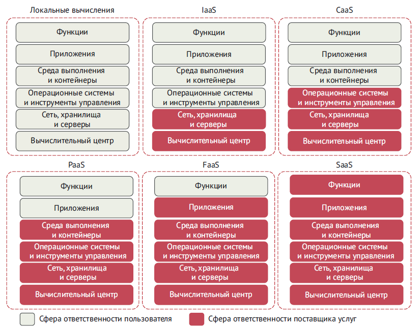

**Одна из основных идей микросервисной архитектуры заключается в том, что каждая служба упаковывается и развертывается
как отдельный и независимый артефакт.**

Развернута служба может быть на следующих источниках:

- _**Физический сервер**_. Можно создавать и развертывать микросервисы на физических машинах, но немногие организации
  делают это из-за ограничений, свойственных физическим серверам. Быстро увеличить емкость физического сервера
  невозможно, а горизонтальное масштабирование микросервиса на нескольких физических серверах может стать чрезвычайно
  дорогостоящим делом.

- _**Образы виртуальных машин**_. Одно из главных преимуществ микросервисов – возможность быстро запускать и
  останавливать экземпляры в ответ на события масштабирования и сбои. Виртуальные машины (ВМ) – это сердце и душа
  ведущих поставщиков облачных услуг.

- _**Виртуальный контейнер.**_ Виртуальные контейнеры являются естественным продолжением образов виртуальных машин. В
  этом сценарии службы развертываются не в полноценной виртуальной машине, а в контейнерах Docker (или аналогичной
  контейнерной технологии) в облаке. Виртуальные контейнеры работают внутри виртуальной машины. Контейнерные технологии
  позволяют разделить одну виртуальную машину на серию автономных процессов, совместно использующих один и тот же образ.
  Микросервис можно упаковать в образ контейнера, а затем быстро развернуть и запустить несколько его экземпляров в
  частном или общедоступном облаке IaaS.

Микросервисы и соответствующая инфраструктура предпочтительно развертывать в облаке на основе CaaS, что даст нам:

- _**Упрощенное управление инфраструктурой.**_
- _**Значительную горизонтальную масштабируемость.**_

Службы, создаваемые в этом пособии, будут упаковываться в контейнеры Docker; основная причина такого решения состоит в
том, что Docker можно развернуть у всех ведущих поставщиков услуг облачных вычислений.

# Микросервисы – это больше чем код #

На рисунке ниже показаны некоторые рекомендации, которые следует учитывать при создании микросервиса.

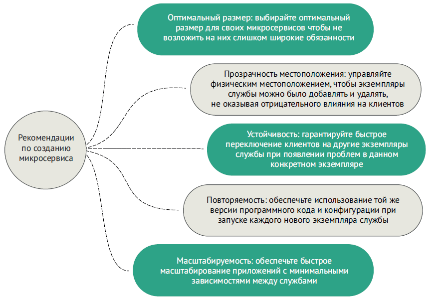

Чтобы получить надежную службу, необходимо учесть несколько аспектов

- Оптимальный размер. Выбирайте оптимальный размер для своих микросервисов, чтобы не возложить на них слишком широкие
  обязанности. Помните, что выбор правильного размера служб позволяет быстро вносить изменения и снижает общий риск сбоя
  всего приложения.

- Прозрачность местоположения. Контролируйте физические детали вызова службы. В приложении на основе микросервисов
  несколько экземпляров службы могут быстро запускаться и завершаться.

- Устойчивость. Защищайте пользователей ваших микросервисов и приложение в целом, организуя маршрутизацию в обход
  отказавших служб и используя решения «отказоустойчивости».

- Повторяемость. Гарантируйте использование одной и той же версии кода и конфигурации при запуске каждого нового
  экземпляра вашей службы.

- Масштабируемость. Организуйте взаимодействия так, чтобы свести к минимуму прямые зависимости между вашими службами и
  гарантировать возможность плавного масштабирования своих микросервисов.

Для учета всех перечисленных рекомендаций в этой книге применяется подход, основанный на шаблонах. В частности, мы
рассмотрим следующие шаблоны проектирования микросервисов:

- базовый шаблон разработки;
- шаблоны маршрутизации;
- шаблоны устойчивости клиентов;
- шаблоны безопасности;
- шаблоны журналирования и трассировки;
- шаблоны сбора метрик приложений.
- шаблон сборки и развертывания;

⚠️Важно понимать, что нет формального свода правил создания микросервисов.

## Базовый шаблон разработки микросервисов ## 

При проектировании микросервиса необходимо подумать о том, как эта служба будет использоваться

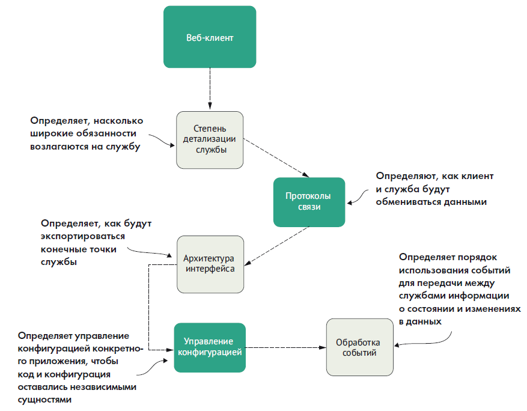

Следующие шаблоны (перечисленные на рисунке) определяют основы создания микросервисов.

- Степень детализации службы. Как правильно выполнить декомпозицию предметной области на микросервисы, чтобы каждый имел
  соответствующий круг обязанностей? Слишком широкий круг обязанностей, включающий разные задачи, затрудняет
  обслуживание и изменение службы с течением времени. Слишком мелкая детализация увеличивает общую сложность приложения
  и превращает службу в простой уровень абстракции данных без какой-либо логики, кроме той, которая необходима для
  доступа к хранилищу.

- Протоколы связи. Протоколы задают порядок взаимодействий с вашей службой. Первый шаг – выбор характера протокола,
  синхронный или асинхронный.
    + Для синхронных взаимодействий чаще всего используется REST на основе HTTP с использованием XML (Extensible Markup
      Language – расширяемый язык разметки), JSON (JavaScript Object Notation – форма записи объектов JavaScript) или
      двоичных форматов, таких как Thrift, для обмена данными.
    + Для асинхронных взаимодействий наиболее популярным выбором является AMQP (Advanced Message Queuing Protocol –
      расширенный протокол организации очередей сообщений), использующий очереди (для взаимодействий типа точка–точка)
      или темы (для взаимодействий типа публикация–подписка) с брокерами сообщений, такими как RabbitMQ, Apache Kafka и
      Amazon Simple Queue Service (SQS).

- Архитектура интерфейса. Как лучше всего организовать интерфейс, который другие разработчики будут использовать для
  вызова вашей службы? Как структурировать оказываемые услуги?

- Управление конфигурацией службы. Как организовать управление конфигурацией микросервиса так, чтобы ее можно было
  перемещать между разными окружениями в облаке?

- Обработка событий между службами. Как с помощью событий минимизировать количество жестких зависимостей между службами,
  и повысить отказоустойчивость приложения?

## Шаблоны маршрутизации ##

Шаблоны маршрутизации микросервисов определяют, как клиентское приложение обнаруживает местонахождение службы и
отправляет ей запросы.

Чтобы обеспечить соблюдение политик безопасности и выбора контента, необходимо абстрагировать физический IP-адрес служб
и организовать единую точку входа. Решить эту задачу помогают следующие шаблоны.

- Обнаружение служб. С помощью функции обнаружения служб и ее ключевого компонента – реестра служб – можно сделать
  микросервис доступным для обнаружения клиентскими приложениями без жесткого определения местоположения службы в их
  коде.

- Маршрутизация служб. С помощью API-шлюза в приложениях на основе микросервисов можно организовать единую точку входа
  для всех служб и обеспечить единообразное применение политик безопасности и правил маршрутизации к нескольким службам
  и их экземплярам.

Маршрутизация служб выполняются в четко определенной последовательности (сначала выполняется маршрутизация, а затем
обнаружение службы). Однако эти две модели не зависят друг от друга. Например, можно реализовать обнаружение служб без
маршрутизации и точно так же можно реализовать маршрутизацию служб без обнаружения.

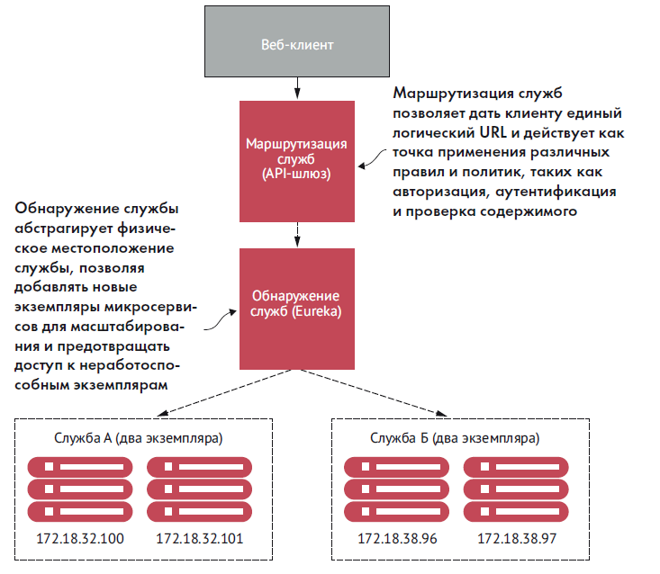

## Устойчивость клиентов ## 

Четыре модели организации устойчивости клиентов.

- Балансировка нагрузки на стороне клиента. Реализуется кешированием местоположений экземпляров службы и равномерным
  распределением трафика между всеми работоспособными экземплярами.

- Шаблон размыкателя цепи (Circuit Breaker). Не позволяет клиенту продолжать обращаться к службе, потерпевшей сбой или
  испытывающей проблемы с производительностью. Медленно работающая служба напрасно потребляет ресурсы вызывающего
  клиента, поэтому вызовы к такой службе должны быстро завершаться с признаком ошибки, чтобы клиент мог быстро
  среагировать и предпринять соответствующие действия.

- Шаблон отката к резервной реализации (fallback). На случай сбоя службы должен иметься «сменный» механизм, который даст
  возможность клиенту попытаться выполнить свою работу с помощью альтернативных средств, отличных от вызываемого
  микросервиса.

- Шаблон герметичных отсеков (Bulkhead). Приложения на основе микросервисов используют несколько распределенных ресурсов
  для выполнения своей работы. Этот шаблон упорядочивает вызовы к этим ресурсам так, чтобы сбой в одной службе не мог
  отрицательно сказаться на остальной части приложения.

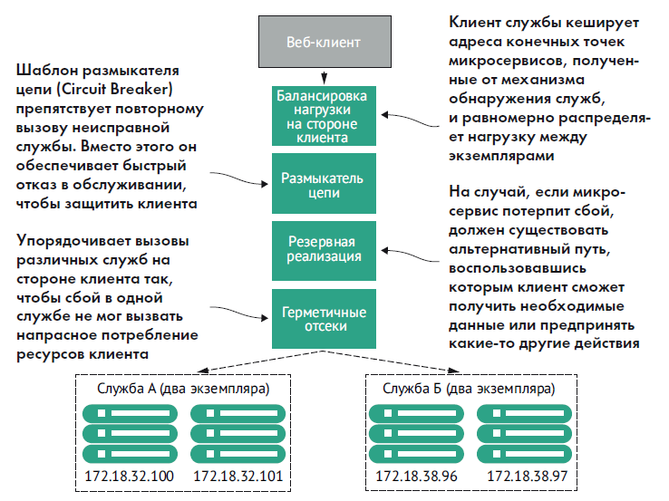

## Шаблоны безопасности ##

- Аутентификация. Помогает определить, что клиент, вызывающий службу, является тем, кем за кого себя выдает.

- Авторизация. Определяет, какие действия разрешено выполнять клиенту службы.

- Управление учетными данными и их распространение. Предотвращает необходимость постоянного предоставления клиентом
  своих учетных данных при обращении к службе. Добиться этого можно с использованием стандартов безопасности на основе
  токенов, таких-как OAuth2 и JSON Web Tokens (JWT), суть которых заключается в получении токена, который можно включать
  в запросы к службе для аутентификации и авторизации пользователя.

На рисунке показано, как можно реализовать эти три шаблона для организации службы аутентификации, которая защитит ваши
микросервисы.
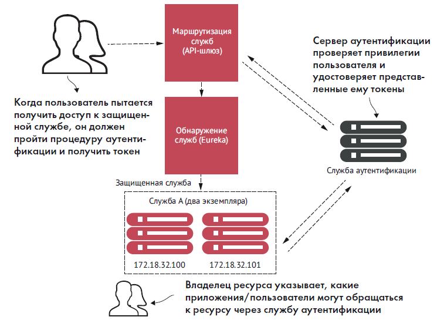

## Шаблоны журналирования и трассировки ##

- Корреляция журналов. Этот шаблон определяет порядок связывания воедино всех журналов, создаваемых службами для
  трассировки одной пользовательской транзакции. На примере этого шаблона мы рассмотрим реализацию идентификатора
  корреляции, который передается во все вызовы служб, участвующие в транзакции, и может использоваться для связывания
  записей в журналах, созданных службами.

- Агрегирование журналов. На примере этого шаблона мы посмотрим, как собрать воедино все журналы, созданные
  микросервисами (и их отдельными экземплярами), в единую базу данных, чтобы потом оценить характеристики
  производительности служб, вовлеченных в транзакцию.

- Трассировка микросервисов. На примере этого шаблона мы посмотрим, как визуализировать поток операций в клиентской
  транзакции, выполняемых всеми задействованными службами, чтобы оценить характеристики их производительности.

На рисунке показано, как эти шаблоны сочетаются друг с другом.

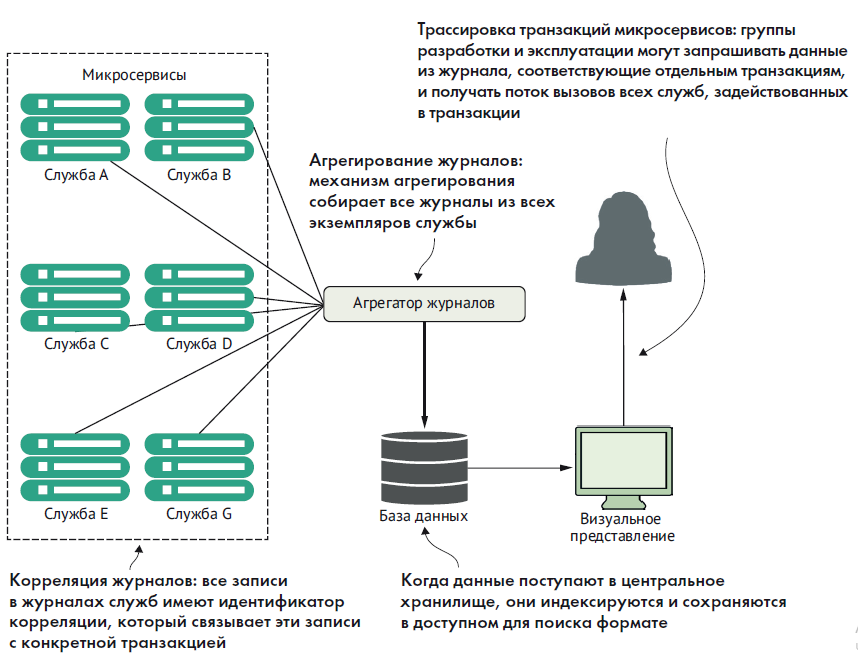

## Шаблон сбора метрик ##

Шаблон сбора метрик описывает порядок извлечения метрик для мониторинга приложения и формирования предупреждений о
возможных сбоях.

Этот шаблон включает три основных компонента.

- Метрики. Фрагменты важной информации, описывающие состояние приложения и как эту информацию получить.

- Служба метрик. Запрашивает метрики у приложения и хранит их.

- Пакет визуализации метрик. Визуализирует данные, характеризующие состояние приложения и инфраструктуры.

Метрики, генерируемые микросервисами, в значительной степени зависят от службы метрик и пакета визуализации.
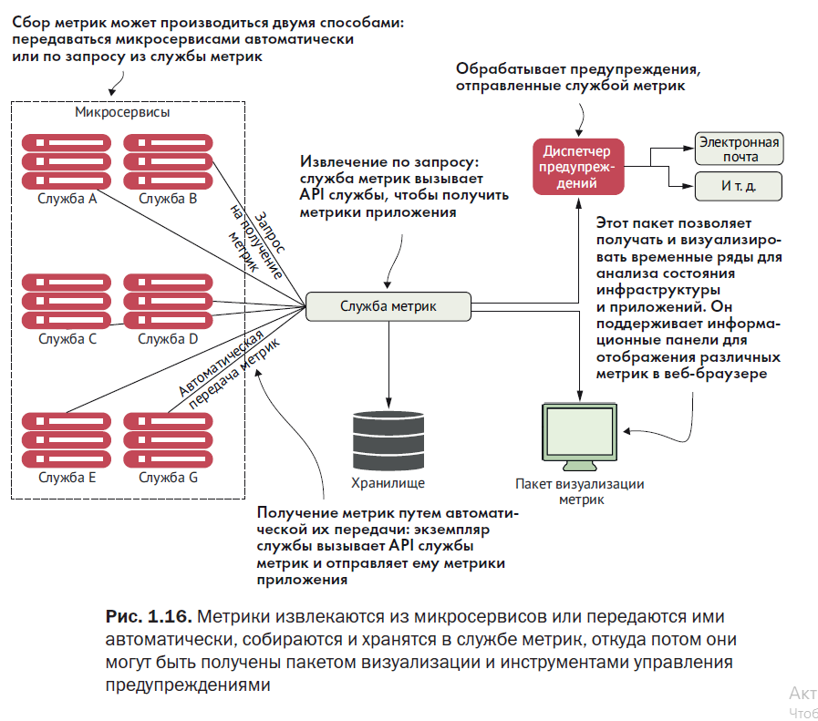

## Шаблоны сборки/развертывания микросервисов ##

⚠️Каждый экземпляр микросервиса должен быть идентичен всем другим его экземплярам. Нельзя допускать дрейфа конфигурации

Цель этого шаблона – интегрировать конфигурацию инфраструктуры прямо в процесс сборки/развертывания, чтобы вам больше не
приходилось развертывать программные артефакты, такие как файлы WAR или EAR, в уже работающую часть инфраструктуры.
Вместо этого процесс сборки должен создавать и компилировать микросервис и образ виртуального сервера для его
выполнения. А процесс развертывания микросервиса должен развертывать образ всей машины с запущенным на ней сервером.

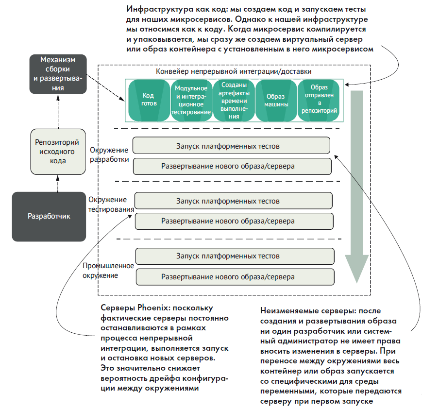

- Конвейеры сборки и развертывания. Помогает определить повторяемый процесс сборки и развертывания, в котором упор
  делается на сборку одной кнопкой и развертывание в любом окружении в вашей организации.

- Инфраструктура как код. Определяет отношение к службам как к коду, который может выполняться и управляться с помощью
  системы управления версиями.

- Неизменяемые серверы. Создание образа микросервиса позволяет гарантировать, что он никогда не изменится после
  развертывания.

- Серверы Phoenix. Гарантирует регулярное отключение и воссоздание серверов, на которых запущены отдельные контейнеры,
  из неизменяемого образа. Чем дольше работает сервер, тем вероятней появление отклонений от стандартной конфигурации.
  Дрейф конфигурации может возникнуть, если специальные изменения в конфигурации не фиксируются в системе управления
  версиями.

Цель этих шаблонов – выявление и безжалостное искоренение дрейфа конфигурации еще до того, как он поразит промышленное
окружение.

⚠️⚠️⚠️ Микросервис и сервер, на котором он выполняется, должны развертываться атомарно, как единый артефакт во всех
окружениях
