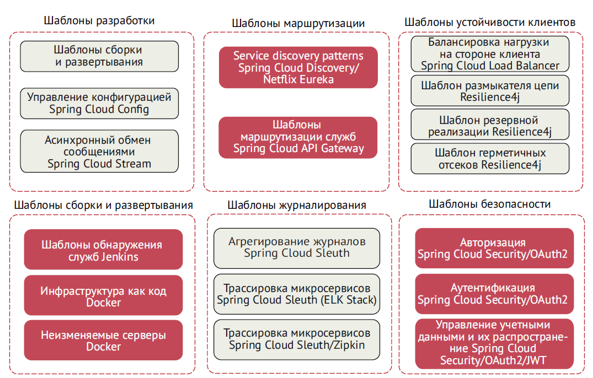
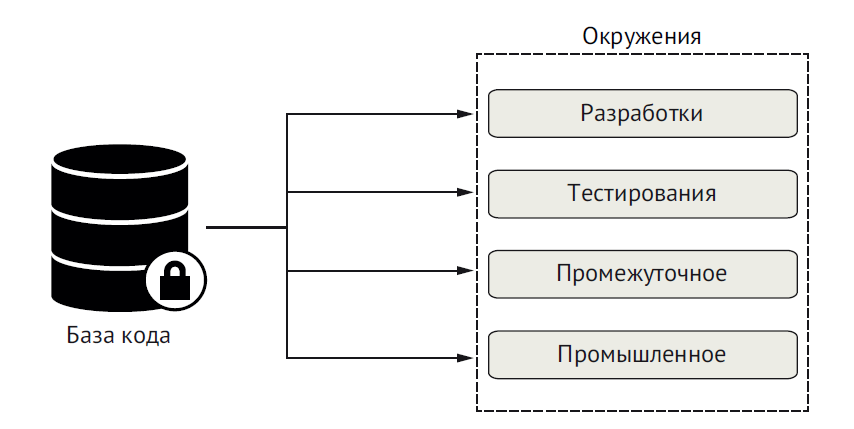
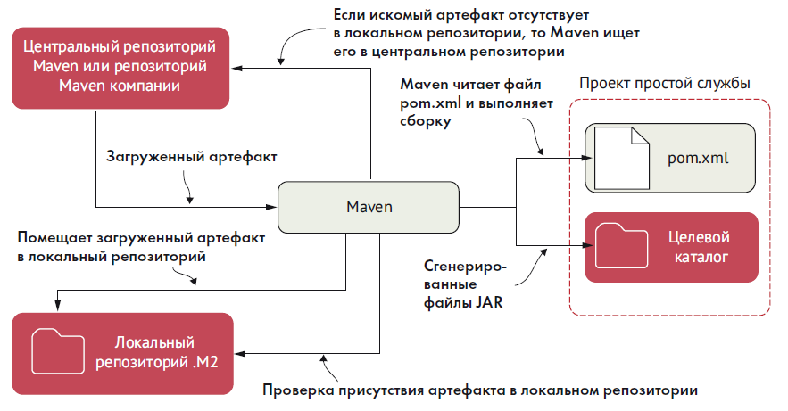
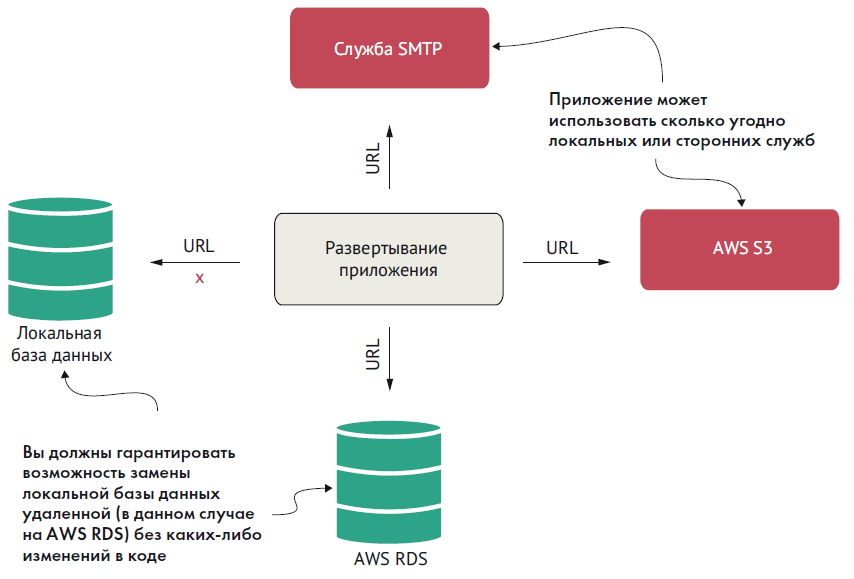
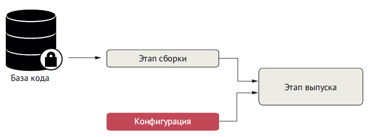
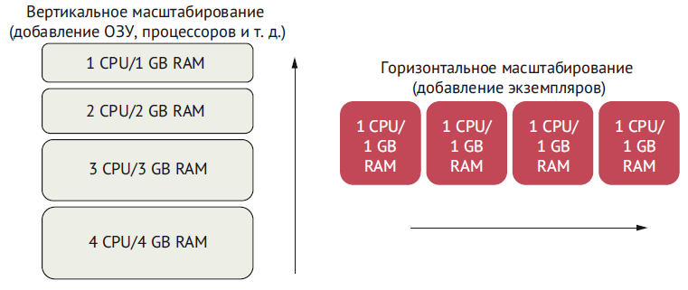
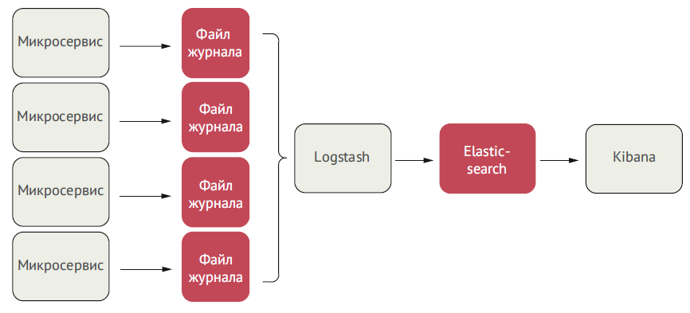

# Spring Cloud #

Фреймворк Spring Cloud предлагает ряд функций (регистрации и обнаружения служб, размыкания цепи, мониторинга и др.),
позволяющих быстро создавать микросервисные архитектуры с минимальны ми конфигурациями.

Spring Cloud – это коллекция инструментов, объединяющая разработки с открытым исходным кодом многих компаний, таких как
VMware, HashiCorp и Netflix. Spring Cloud упрощает установку и настройку наших проектов и предоставляет реализации
шаблонов, особенно часто встречающихся в приложениях на основе Spring.

На рис показаны шаблоны, и их деление на проекты в Spring Cloud.

## Spring Cloud Config ##

Spring Cloud Config помогает организовать управление конфигурационными данными приложения через централизованную службу,
что позволяет четко отделить конфигурацию приложения (в частности, настройки окружения) от развернутого микросервиса.
Благодаря такому подходу все экземпляры микросервиса, независимо от их количества, будут иметь одинаковую конфигурацию.

Cloud Config имеет свой репозиторий управления свойствами, а также интегрируется со многими проектами с открытым
исходным кодом, такими как:

- Git (https://git-scm.com/). Система управления версиями с открытым исходным кодом, которая позволяет контролировать
  изменения в любых текстовых файлах. Spring Cloud Config может интегрироваться с репозиторием Git и извлекать из него
  конфигурации приложений;

- Consul (https://www.consul.io/). Система обнаружения служб с открытым исходным кодом, которая позволяет регистрировать
  в ней экземпляры служб. Клиенты могут обращаться к системе Consul, чтобы узнать местоположение экземпляров нужных им
  служб. Также Consul имеет свое хранилище пар ключ/значение, в котором Spring Cloud Config может хранить конфигурации
  приложений;

- Eureka (https://github.com/Netflix/eureka). Проект Netflix с открытым исходным кодом, который, как и Consul,
  предлагает аналогичные возможности обнаружения служб. В Eureka тоже есть свое хранилище пар ключ/значение, которое
  может использоваться Spring Cloud Config.

## Spring Cloud Service Discovery ##

Шаблон Spring Cloud Service Discovery помогает организовать обнаружение служб клиентами независимо от физического
местоположения (IP-адреса и/или имени) ваших серверов. Клиенты вызывают бизнес-логику, используя логическое имя вместо
физического адреса. Spring Cloud Service Discovery также предусматривает регистрацию экземпляров службы при их запуске и
отмену регистрации по завершении работы. Реализовать Spring Cloud Service Discovery можно с помощью:

Consul (https://www.consul.io/); Zookeeper (https://spring.io/projects/spring-cloud-zookeeper);
Eureka (https://github.com/Netflix/eureka) в качестве механизма обнаружения служб.

## Spring Cloud LoadBalancer и Resilience4j ##

Библиотеку Resilience4j можно найти по адресу: https://github.com/resilience4j/resilience4j. С помощью библиотеки
Resilience4j можно быстро реализовать такие шаблоны отказоустойчивости клиента, как размыкатель цепи (Circuit Breaker),
повторные попытки
(Retries), герметичные отсеки (Bulkhead) и др.

## Spring Cloud API Gateway ## 

API Gateway предоставляет возможность маршрутизации служб в приложениях на основе микросервисов. Как следует из названия
(API Gateway – API-шлюз), это – шлюз, передающий запросы службам и служащий единой точкой входа в ваши микросервисы.
Такая централизация позволяет применять стандартные политики, такие как авторизация, аутентификация, фильтрация
содержимого и правила маршрутизации. API-шлюз можно реализовать с помощью Spring Cloud
Gateway (https://spring.io/projects/spring-cloudgateway).

## Spring Cloud Stream ## 

Spring Cloud Stream (https://cloud.spring.io/spring-cloud-stream) – это технология, позволяющая интегрировать
легковесную обработку сообщений в микросервисы. С помощью Spring Cloud Stream можно создавать интеллектуальные
микросервисы, использующие асинхронные события, которые происходят в вашем приложении. Также Spring Cloud Stream
позволяет быстро интегрировать микросервисы с брокерами сообщений, такими как RabbitMQ (https://www.rabbitmq.com) и
Kafka (http://kafka.apache.org).

## Spring Cloud Sleuth ## 

Spring Cloud Sleuth (https://cloud.spring.io/spring-cloud-sleuth/) позволяет интегрировать уникальные идентификаторы
трассировки в HTTP-вызовы и каналы сообщений (RabbitMQ, Apache Kafka), используемые в приложении. Идентификаторы
трассировки, которые иногда называют идентификаторами корреляции, помогают отслеживать прохождение транзакций через
различные службы. Spring Cloud Sleuth автоматически добавляет идентификаторы трассировки в любые операции
журналирования, выполняемые в микросервисе. Достоинства Spring Cloud Sleuth особенно ярко проявляются в сочетании с
инструментами агрегирования журналов, такими как ELK Stack (https://www.elastic.co/what-is/elk-stack), и трассировки,
такими как Zipkin (http://zipkin.io). Open Zipkin принимает данные, созданные Spring Cloud Sleuth, и визуализирует поток
вызовов служб, задействованных в данной транзакции. ELK Stack – это аббревиатура, составленная из первых букв названий
трех проектов с открытым исходным кодом:

- Elasticsearch (https://www.elastic.co) – поисковая и аналитическая система;

- Logstash (https://www.elastic.co/products/logstash) – конвейер обработки данных на стороне сервера, который принимает
  данные и преобразует их для отправки в «хранилище» (stash);

- Kibana (https://www.elastic.co/products/kibana) – клиентский интерфейс, с помощью которого пользователи могут
  запрашивать и визуализировать данные всего стека.

## Spring Cloud Security ## 

Spring Cloud Security (https://cloud.spring.io/spring-cloudsecurity/)
– это фреймворк аутентификации и авторизации, управляющий доступом к вашим службам и операциям. Принцип действия Spring
Cloud Security основан на токенах, что позволяет службам взаимодействовать друг с другом, используя токены, выданные
сервером аутентификации. Каждая служба, получив HTTP-запрос, может проверить предоставленный токен, чтобы подтвердить
личность пользователя и его привилегии. Spring Cloud Security также поддерживает веб-токены JSON Web Tokens
(JWT). JWT (https://jwt.io) определяет стандартный формат для создания токена OAuth2 и нормализует цифровые подписи для
сгенерированного токена.

## **Приемы создания облачных микросервисов** ## 

Приложение, **_пригодное для использования в облаке_**, – это приложение, которое первоначально предназначалось для
выполнения на локальном компьютере или сервере. Чтобы сделать такое приложение пригодным для использования в облаке,
нужно вынести его конфигурацию вовне, чтобы адаптировать ее к различным окружениям. В этом случае мы сможем обеспечить
работу приложения в нескольких окружениях без изменения исходного кода.

_**Изначально облачное приложение**_ с самого начала проектировалось для работы в облачном окружении и способно
использовать все его преимущества. При создании приложений этого типа разработчики разбивают функции на микросервисы и
организуют их в масштабируемые компоненты, такие как контейнеры, что позволяет им выполняться на нескольких серверах.
Эти службы управляются виртуальными инфраструктурами через процессы DevOps и непрерывной доставки. Важно понимать, что
приложения, пригодные для использования в облаке, не требуют никаких изменений или преобразований. Они уже
предусматривают обработку ситуаций, когда нижестоящие компоненты могут оказаться недоступными.

### Четыре принципа разработки изначально облачных приложений ###

1. DevOps – это аббревиатура из начальных букв слов «development»
   (Dev; разработка) и «operations» (Ops; эксплуатация). Она обозначает методологию разработки программного обеспечения,
   предполагающую тесное сотрудничество разработчиков и специалистов, осуществляющих эксплуатацию и сопровождение
   программного обеспечения. Основная цель этой методологии – автоматизировать процессы доставки программного
   обеспечения и минимизировать затраты на изменение инфраструктуры;

2. микросервисы – это небольшие, слабо связанные распределенные службы. Архитектура микросервисов позволяет взять
   большое приложение и разложить его на простые в управлении компоненты с узко ограниченными обязанностями, а также
   помогает бороться с проблемами сложности, характерными для больших баз кода, разбивая их на мелкие, четко
   определенные части;

3. непрерывная доставка – это практика разработки программного обеспечения. Согласно этой практике процесс доставки
   программного обеспечения автоматизируется, что обеспечивает быструю доставку в промышленное окружение;

4. контейнеры являются естественным продолжением развертывания микросервисов в образе виртуальной машины (ВМ). Вместо
   полноценной ВМ многие разработчики развертывают свои службы в контейнерах Docker (или в аналогичных системах
   управления контейнерами) в облаке.

Для решения проблем, сопутствующих созданию облачных микросервисов, можно использовать руководство с названием
_**«Приложение двенадцати факторов»**_ Методология двенадцати факторов может быть применена для приложений,
написанных на любом языке программирования и использующих любые комбинации сторонних служб (backing services)
(базы данных, очереди сообщений, кэш-памяти, и т.д.).

📙 Методология двенадцати факторов, представляет наиболее полный свод правил, которым нужно следовать при создании
облачных приложений.

### [I. Кодовая база](additional/TwelveFactors/I.md) ###

Одна кодовая база, отслеживаемая в системе контроля версий, – множество развёртываний

### [II. Зависимости](additional/TwelveFactors/II.md) ###

Явно объявляйте и изолируйте зависимости

### [III. Конфигурация](additional/TwelveFactors/III.md) ###

Сохраняйте конфигурацию в среде выполнения

### [IV. Сторонние службы](additional/TwelveFactors/IV.md) ###

IV. Сторонние службы (Backing Services)
Считайте сторонние службы (backing services) подключаемыми ресурсами

### [V. Сборка, релиз, выполнение](additional/TwelveFactors/V.md) ###

Строго разделяйте стадии сборки и выполнения

### [VI. Процессы](additional/TwelveFactors/VI.md) ###

Запускайте приложение как один или несколько процессов не сохраняющих внутреннее состояние (stateless)

### [VII. Привязка портов (Port binding)](additional/TwelveFactors/VII.md) ###

Экспортируйте сервисы через привязку портов

### [VIII. Параллелизм](additional/TwelveFactors/VIII.md) ###

Масштабируйте приложение с помощью процессов

### [IX. Утилизируемость (Disposability)](additional/TwelveFactors/IX.md) ###

Максимизируйте надёжность с помощью быстрого запуска и корректного завершения работы

### [X. Паритет разработки/работы приложения](additional/TwelveFactors/X.md) ###

Держите окружения разработки, промежуточного развёртывания (staging) и рабочего развёртывания (production) максимально
похожими

### [XI. Журналирование](additional/TwelveFactors/XI.md) ###

Рассматривайте журнал как поток событий

### [XII. Задачи администрирования](additional/TwelveFactors/XII.md) ###

Выполняйте задачи администрирования/управления с помощью разовых процессов

## База кода ##

В соответствии с этой практикой каждый микросервис должен иметь свою отдельную базу исходного кода. Кроме того, важно
подчеркнуть, что информация о конфигурации сервера также должна находиться в системе управления версиями. Помните,
что управление версиями – это управление изменениями в файлах или в наборе файлов.
База кода может включать несколько экземпляров окружений развертывания (таких, как окружение разработки, окружение
тестирования, промышленное окружение и т. д.), но не имеет общих компонентов с другими микросервисами.

Отдельная база кода с множеством окружений развертывания

## Зависимости ##

Эта практика требует явно объявлять и изолировать зависимости вашего приложения, используя инструменты сборки, такие как
Maven или Gradle (Java). Зависимости от сторонних JAR должны объявляться с указанием конкретных номеров версий этих
артефактов. Это позволит создавать микросервисы всегда с одной и той же версией библиотеки.

## Конфигурация ##

Эта практика относится к хранению конфигураций приложения (особенно конфигураций, зависящих от окружения). Никогда
не добавляйте конфигурации в исходный код! Полностью отделяйте конфигурацию от развертываемого микросервиса.

## Вспомогательные службы ##

Микросервисы часто обмениваются данными по сети с базами данных, службами RESTful, другими серверами или системами
обмена сообщениями. В таких случаях вы должны гарантировать возможность замены локальных служб сторонними без каких-либо
изменений в коде приложения.

Пример некоторых вспомогательных служб, которые могут использовать наши приложения.

## Сборка, выпуск, выполнение ##

Эта практика напоминает о необходимости четкого разделения этапов сборки, выпуска и выполнения приложения.
Микросервисы не должны зависеть от окружения, в котором они выполняются. Любые изменения в окружении, произведенные
после сборки
кода, должны приводить к повторению процессов сборки и развертывания. Скомпилированная служба считается
зафиксированной и не может быть изменена.

Этап выпуска отвечает за объединение скомпилированной службы с определенной конфигурацией для каждого целевого
окружения.
Если не разделить разные этапы, то это может привести к проблемам и расхождениям в коде, которые невозможно или –
в лучшем случае – трудно отследить.

## Процессы ## 

Микросервисы не должны иметь состояния и хранить только информацию, необходимую для выполнения запрошенной
транзакции. Микросервисы могут быть остановлены в любой момент,и потеря экземпляра службы не должна приводить к потере
данных. Если состояние все же необходимо, то оно должно храниться в кеше, таком как Redis, или во внутренней базе
данных.

## Привязка портов ##

Под привязкой портов подразумевается экспортирование служб через определенные порты. В микросервисной архитектуре
микросервисы полностью автономны, и каждый имеет свой механизм времени выполнения, упакованный в выполняемый файл
вместе с кодом службы. Служба не должна нуждаться в отдельном веб-сервере или сервере приложений и должна поддерживать
возможность запуска из командной строки и непосредственного подключения к ней через открытый порт HTTP.

## Масштабируемость ## 

Согласно практике масштабируемости облачные приложения должны масштабироваться по горизонтали с использованием модели
процессов. Что это значит? Это значит, что должна иметься возможность вместо одного процесса запустить несколько
процессов, чтобы потом распределить нагрузку между ними. Под вертикальным масштабированием подразумевается увеличение
мощности аппаратной инфраструктуры (процессор, объем ОЗУ), а под горизонтальным – запуск дополнительных экземпляров
приложения.

Разница между вертикальным и горизонтальным масштабированием

## Одноразовость ##

Микросервисы должны быть одноразовыми и запускаться и останавливаться по запросу, чтобы упростить эластичное
масштабирование и быстрое развертывание приложения и изменений в конфигурации. В идеале запуск должен длиться не
дольше пары секунд с момента команды запуска до момента, когда процесс будет готов
принимать запросы. Под одноразовостью мы подразумеваем возможность удаления отказавших экземпляров и запуск новых без
влияния на другие службы.

## Сходство окружений разработки/эксплуатации ##

Эта практика требует обеспечить максимальное сходство разных окружений (например, разработки, тестирования, промышлен-
ной эксплуатации). Окружения всегда должны содержать похожие версии развернутого кода, инфраструктуры и служб. Этого
можно добиться с помощью непрерывного развертывания, которое максимально автоматизирует процесс развертывания, позволяя
развертывать микросервисы в нескольких окружениях за короткое время. После отправки в репозиторий код следует
протестировать, а затем как можно быстрее передать из окружения разработки в промышленное окружение.

## Журналирование ## 

Журналы – это поток событий. Журналы должны управляться такими инструментами, как
Logstash (https://www.elastic.co/logstash) или Fluentd (https://www.fluentd.org/),
которые собирают и хранят журналы в централизованном хранилище. Микросервис
никогда не должен заботиться о том, как это происходит. От него требуется только выводить журналируемую информацию в
стандартный вывод (stdout).

Журналирование в микросервисной архитектуре

## Задачи администрирования ## 

Разработчикам часто приходится выполнять задачи администрирования своих служб (например, переносить или
преобразовывать данные). Такие задачи не должны быть уникальными и всегда выполняться только с помощью сценариев,
которые хранятся и обслуживаются через репозиторий исходного кода. Сценарии должны быть повторяемыми и неизменяемыми (т.
е. код сценария не должен изменяться) в каждом окружении. Важно определить типы задач, которые должны выполняться при
запуске микросервиса, чтобы при наличии нескольких микросервисов с такими сценариями мы могли выполнять все задачи
администрирования без любых манипуляций вручную.

